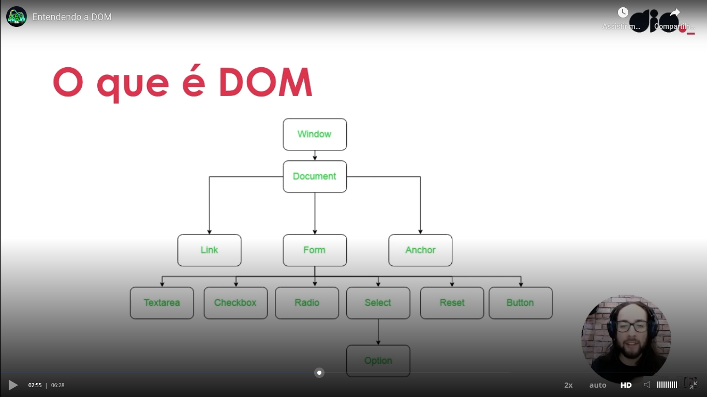

# General

Example of DOM hierarchy, with some elements:



We have the method "getElementsByTagName()" of the document of of an element returns an array of matches. Example:

```
document.getElementsByTagName("td"); // The return depends on the rendered web page
```